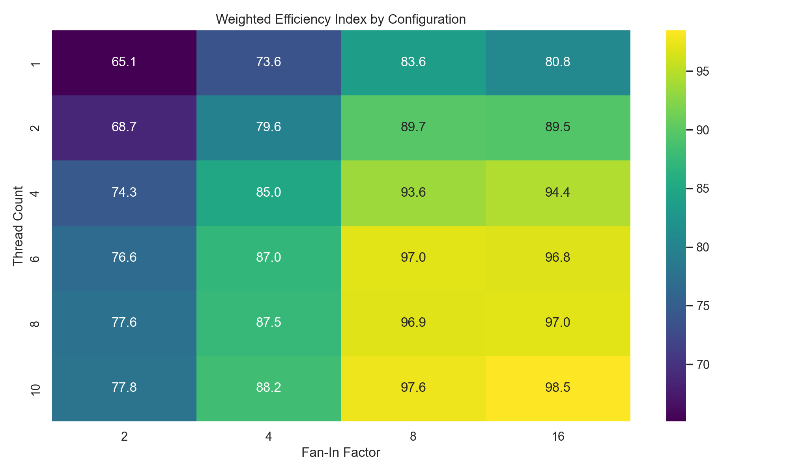

# What I Built 

I built an external sorter in Rust to sort datasets too big to fit in
RAM. For context, my Mac's CPU has 10 cores (4 main performance cores)
and 16 GB Memory. It streams unsigned 64-bit binary data from the SSD to
RAM using 16 KB page-aligned buffers to match Apple's M-series virtual
memory page size.

- **1 Chunk Sorting:** Reads 20 MB of data to RAM at a time and sorts in
  parallel across CPU cores using Rayon.

- **2 Merging Runs:** Uses a Min-Heap to merge all sorted chunks back
  into one sorted file.

The memory per chunk was limited to 20 MB to simulate physical memory
limits and force streaming through the SSD.

# Results 


<figcaption><strong>Configuration Efficiency Heatmap:</strong> Compares
thread count and fan-in factor to find the most efficient
configuration.</figcaption>
</figure>

<figure id="fig:phase_breakdown" data-latex-placement="H">

<figcaption><strong>Distribution’s Effect on Phase Runtime:</strong> On
average, Phase 1 is very fast on ascending/descending (sorted/reverse
sorted) data (<span class="math inline"> ∼ 75%</span> speedup compared
to random distribution), but Phase 2 takes up most of the total runtime
regardless of distribution.</figcaption>
</figure>

# Main Takeaways {#main-takeaways .unnumbered}

## 1. Performance Ceiling (CPU Cores) {#performance-ceiling-cpu-cores .unnumbered}

I looked into my Mac's hardware and noticed my CPU had 10 cores (4 main
performance cores). I wanted to see if using all 10 cores would make
sorting twice as fast. Going from 1 $\rightarrow$ 4 threads gave a
relatively big speedup (14.6%) because it utilized the performance
cores. However, the jump from 4 $\rightarrow$ 10 threads only gave a
4.3% speedup. The performance cores likely end up waiting on the slower
efficiency cores during Phase 1 when the CPU is sorting the arrays in
RAM, so more cores had diminishing returns.

## 2. The Distribution Matters (Phase 1 vs Phase 2) {#the-distribution-matters-phase-1-vs-phase-2 .unnumbered}

Sorted/Reverse sorted data made Phase 1 run $\sim 75\%$ faster because
of CPU branch prediction. Phase 2 runtime stayed relatively steady
across all distribution types.

**Best Configurations Overall**\

   **Threads**   **Fan-In**   **Efficiency Score**
  ------------- ------------ ----------------------
       10            8               97.61%
       10            16              98.48%
        8            16              97.05%

## 3. Peak Speed {#peak-speed .unnumbered}

The fastest performance of the external sorting engine was 517 MB/s.

## Structure

```text
external-sorter/
├── data_utils.py          # Python data suite (high-entropy generator & verifier)
├── Cargo.toml             # Workspace definition
├── src/
│   ├── main.rs            # End-to-end CLI driver interface
│   ├── lib.rs             # Library root exposing reusable phase modules
│   ├── config.rs          # Central tuning parameter constraints
│   ├── phase1.rs          # Bounded chunk splitting & parallel sorting logic
│   ├── phase2.rs          # Streaming Min-Heap K-way merging engine
│   └── bin/
│       └── benchmark.rs   # Comprehensive matrix sweeping benchmark harness
